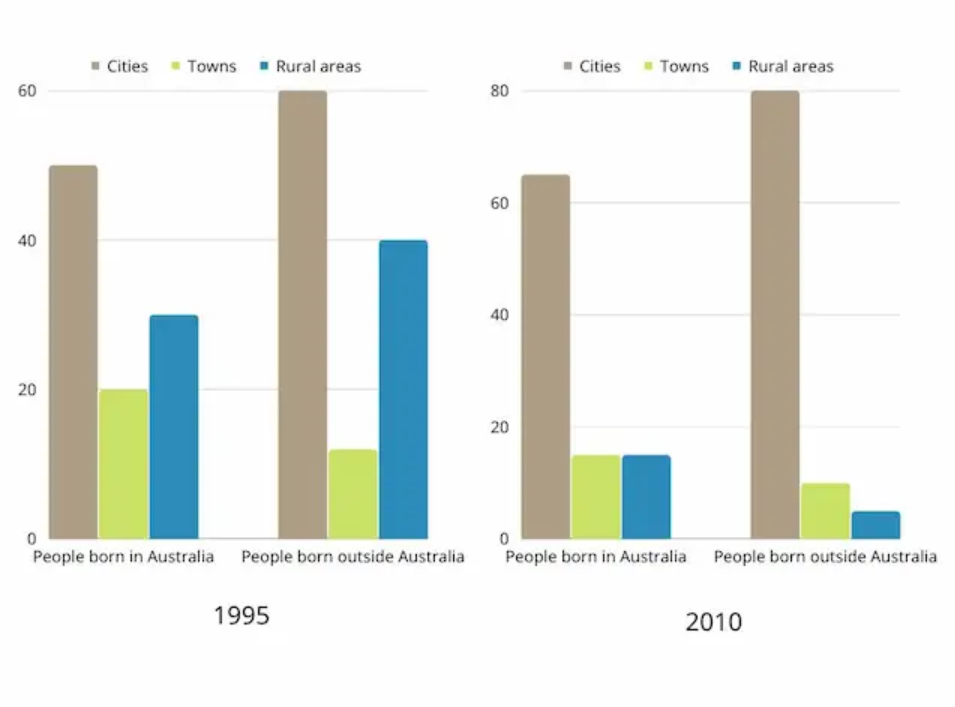

# Writing Task 1

The bar chart below describes some changes about the percentage of people were born in Australia and who were born outside Australia living in urban, rural and town between 1995 and 2010.

Summarise the information by selecting and reporting the main features and make comparisons where relevant.

You should write at least 150 words.



```html
The charts show a great rise in the number of people living cities over the years. This information is relevant for the people born in and outside Australia. Likewse, towns and rural areas have seen a great in population. Among which, rural areas are seen to have the greatest decline for the people born outside Australia. However, the decline is extensive even for the people born in Australia.
In detail, the population of cities are seen to have about 15% of increase in population among he people born in Australia. Likewise, the towns and rural areas have witnessed a decrease of about 5% and 15% respectively.
Similarly, among the population born outside Australia, cities have seen a rise in population by 20% while the towns and rural areas are seen to have a decreased population by about 5% and 35% respectively.
```

## Writing Task 2

Rich countries often give money to poorer countries, but it does not solve poverty. Therefore, developed countries should give other types of help to the poor countries rather than financial aid. To what extent do you agree or disagree?

```html
The given statement can greatly be agreed upon. While, financial help is one of the most popular ways for countries to assist each other during the time of need, many poor countries may lack proper management or may be affected by other factors that restrict them from making good use of it. Corruption is one of the biggest problems especially among the undeveloped or developing counties.
Financial aids provided by other countries can easily be exploited by the corrupted nature of a government. This may greatly impact how, or whether even if the general population of the country recieves the provided aid. Likewise, the countries providing the donations may also not see a significant impact of their giving.
There are many other ways through which a country more capable of helping can provide aid to the nations in need. Manpower, millitary support or any form of physical aid such as healthcare accessories, food, tents and many more can be provided instead of financial aid. These types of aid can be distributed directly among the population and can comparatively be more time-efficient.
However, physical aids are also not completely resistant from corruption either. There have been many cases where even such forms of aid have been used and exploited by the corrupted systems for personal benifit. Physical aid may also be more difficult to deliver as quickly as possible than financial aid. The transport of the aid can alone be very expensive and even more if it is to be provided as soon as possible.
```
