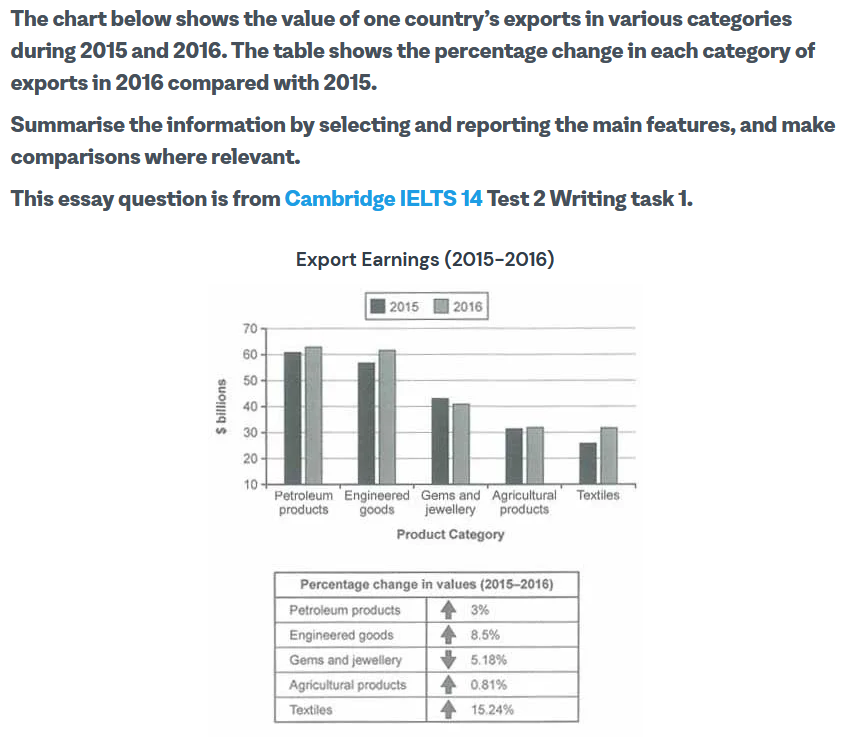

# Writing Test 2



```python
Export of goods greatly contribute to the overall economy of a country. Categorizing these goods based on they’re type and usage allows us to gain a larger outlook on the economic performance of the country.

The given data signifies that the Textile industry has greatly contributed to the counties economy over the span of 1 year. The export of textiles have increased by 15.24% which is the highest growth among all the other categories. Engineered goods follows the list with a growth of 8.5%. Likewise, Petroleum and agricultural products have also shown a positive growth by 3% and 0.81%. However, the export of gems and jewelry products are seen to have decreased by 5.18%.

Categorizing the export of goods allows the country to make better trade decisions in the future. As per the information it can be suggested to focus greatly on the production of textile and engineered goods as these categories show a highly growing trend.
```
