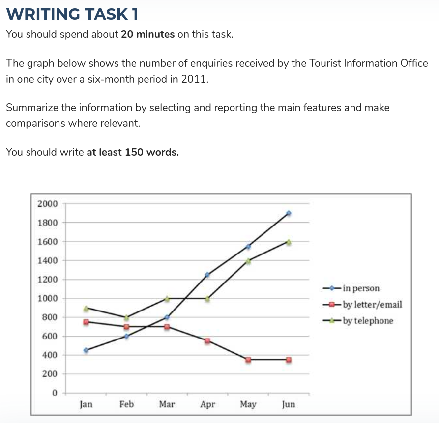

# Writing Task 1

**Answer:**

The line chart depicts the enquiries recieved by the Tourist Information Office in the year 2011. Information recieved over the span of six months is categorized into three types based on how they were recieved.
The enquiries submitted in person have increased greatly over the period. The numbers have spiked from being the lowest during the first month to the highest among the three categories by the end. Telephone channels are also seen to have also increased in popularity. However, the use of emails and letters for enquiry have decreased by a significant amount over the span of six months.
The number of enquiries submitted in-person have risen from about 450 in January to almost 1900 enquiries in June. It is also noticable that this growth is consistant over the years with a slightly great spike between March and April.
The number of enquiries recieved via letter and email have also grown from about 900 to 1600 over the period. Lastly, the use of telephone for enquiry have decreased greatly from about 750 at the beginning month to only 150 in June.

## Writing Task 2

**Question:**

You should spend about 40 minutes on this task. Individuals can do nothing to improve the environment; only governments and large companies can make a difference. To what extent do you agree or disagree? Give reasons for your answer and include any relevant examples from your own knowledge or experience. You should write at least 250 words.

**Answer:**

Preserving the environment is a difficult yet an extremely important task. With the increasing pollution and global warming, it is high time for everyone to take be take action for preserving the environment. The statement stating that the government and large companies are only responsible towards the improvement of the environment is untrue.
Although it may be true that factories and vehicles owned by governments and large companies have contributed greatly towards the deplition of the environment, we as individuals are also accountable for many factors affecting it. Individual decisions such as how one manages their household wastes greatly impacts the waste management of a larger society when looked into at a larger scale. Likewise, even the smallest individual decisions such as the daily products one uses and the store they decide to shop at largely impacts the decisions of the governemnt and massive companies which then supposedly impacts the environment.
However, the governing bodies also hold great power that can make significant difference towards environmental development. Likewise, large corporates also have greater financial strenght and the ability to make decisions that can reduce the negative impact to the environment. It is true that the wastes produced from factories largly impact the environment and animal life. However, the wastes that come from individual households and personal vehicles also equally contribute to the environmental deplition.
Therefore, the responsibility for developing the environment goes hand in hand. Governments and large companies should be resposible towards running campaigns and creating legislations that support the environment. Likewise, individuals should be more responsible towards adapting a more environment friendly lifestyle.

## BARD Judgement Question 1

Overall feedback:

The writing test answer is well-written and informative. The writer clearly summarizes the main features of the line graph and makes appropriate comparisons. The answer is also well-organized and easy to follow.

Specific feedback:

    Grammar: The grammar in the writing test answer is generally accurate. However, there are a few minor errors, such as:
        "Information recieved over the span of six months is categorized into three types based on how they were recieved." (The correct sentence structure is "Information received over a six-month period is categorized into three types based on how it was received.")
        "The enquiries submitted in person have increased greatly over the period." (The correct sentence structure is "The number of enquiries submitted in person has increased greatly over the period.")
    Vocabulary: The vocabulary in the writing test answer is appropriate and varied. The writer uses a range of academic vocabulary, such as "depicts," "recieved," "categorized," "significance," "consistant," "spike," and "greatly."
    Task response: The writing test answer addresses all parts of the task. The writer clearly states the main features of the line graph (that enquiries submitted in person and over the phone increased, while enquiries submitted via email and letter decreased), and they make appropriate comparisons (e.g., "The number of enquiries submitted in-person have risen from about 450 in January to almost 1900 enquiries in June.").
    Organization: The writing test answer is well-organized and easy to follow. The writer uses clear paragraphs and transition words to guide the reader through the summary.

Overall impression:

The writing test answer is clear, concise, and well-written. The writer's summary is accurate and informative, and their language is appropriate for a formal academic style.

Overall score: 7.5

Suggestions for improvement:

    The writer could improve their grammar by carefully proofreading their work before submitting it.
    The writer could also improve their vocabulary by using more specific and descriptive words. For example, instead of saying "The number of enquiries submitted in-person have increased greatly over the period," the writer could say "The number of enquiries submitted in person has skyrocketed from 450 in January to almost 1900 in June."
    Finally, the writer could improve their organization by adding a concluding paragraph to summarize their main points and restate their thesis statement.

Overall, the writing test answer is very well-written. With a few minor changes, the writer could easily achieve a score of 8 or higher.

## BARD Judgement Question 2

Overall feedback:

The writing test answer is well-written and informative. The writer clearly states their position on the issue (that both individuals and governments and large companies have a role to play in improving the environment), and they provide specific reasons and examples to support their position. The answer is also well-organized and easy to follow.

Specific feedback:

    Grammar: The grammar in the writing test answer is generally accurate. However, there are a few minor errors, such as:
        "Preserving the environment is a difficult yet an extremely important task." (The correct sentence structure is "Preserving the environment is a difficult but extremely important task.")
        "The statement stating that the government and large companies are only responsible towards the improvement of the environment is untrue." (The correct sentence structure is "The statement that only the government and large companies are responsible for improving the environment is untrue.")
    Vocabulary: The vocabulary in the writing test answer is appropriate and varied. The writer uses a range of academic vocabulary, such as "preserving," "environmental deplition," "governing bodies," "financial strength," and "legislations."
    Task response: The writing test answer addresses all parts of the task. The writer clearly states their position on the issue (that both individuals and governments and large companies have a role to play in improving the environment), and they provide specific reasons and examples to support their position. For example, the writer states that individuals can make a difference by managing their household waste responsibly and choosing to shop at stores that sell environmentally friendly products. The writer also states that governments and large companies can make a difference by running campaigns and creating legislations that support the environment.
    Organization: The writing test answer is well-organized and easy to follow. The writer uses clear paragraphs and transition words to guide the reader through their argument.

Overall impression:

The writing test answer is clear, concise, and well-written. The writer's argument is well-supported, and their language is appropriate for a formal academic style.

Overall score: 8

Suggestions for improvement:

    The writer could improve their grammar by carefully proofreading their work before submitting it.
    The writer could also improve their vocabulary by using more specific and descriptive language. For example, instead of saying "However, the wastes that come from individual households and personal vehicles also equally contribute to the environmental deplition," the writer could say "However, the waste produced from individual households and personal vehicles also significantly contributes to the degradation of the environment."

Overall, the writing test answer is very well-written. With a few minor changes, the writer could easily achieve a score of 8.5 or higher.